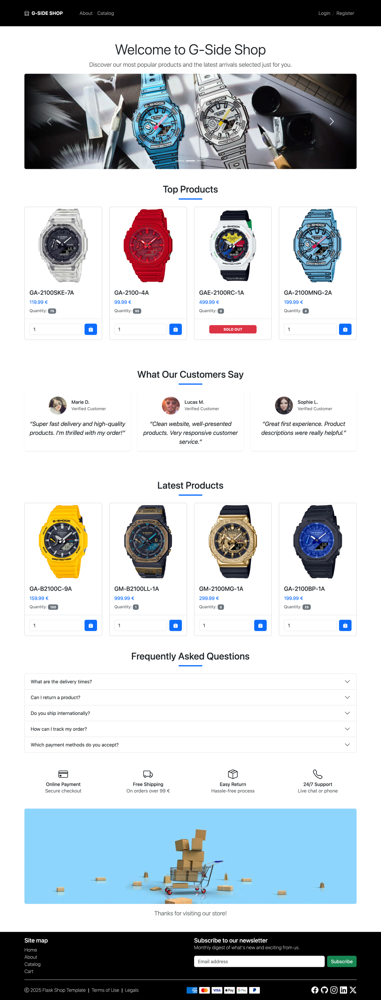
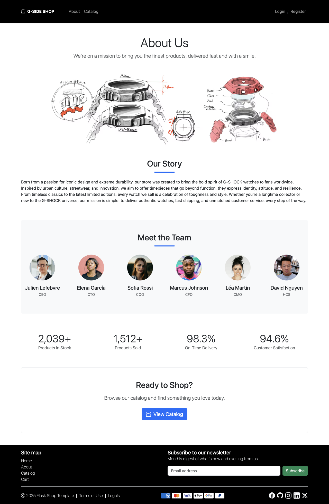
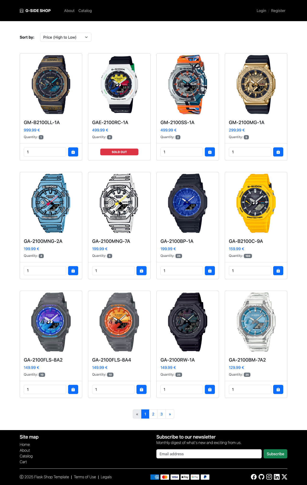
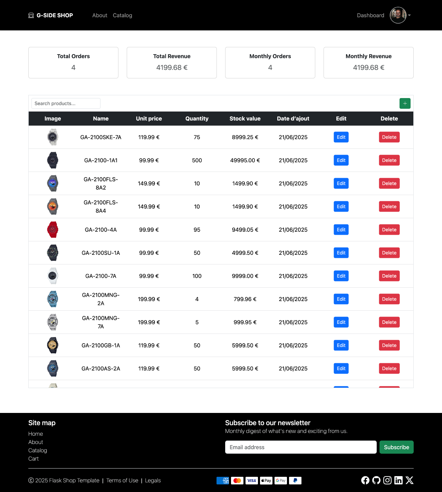
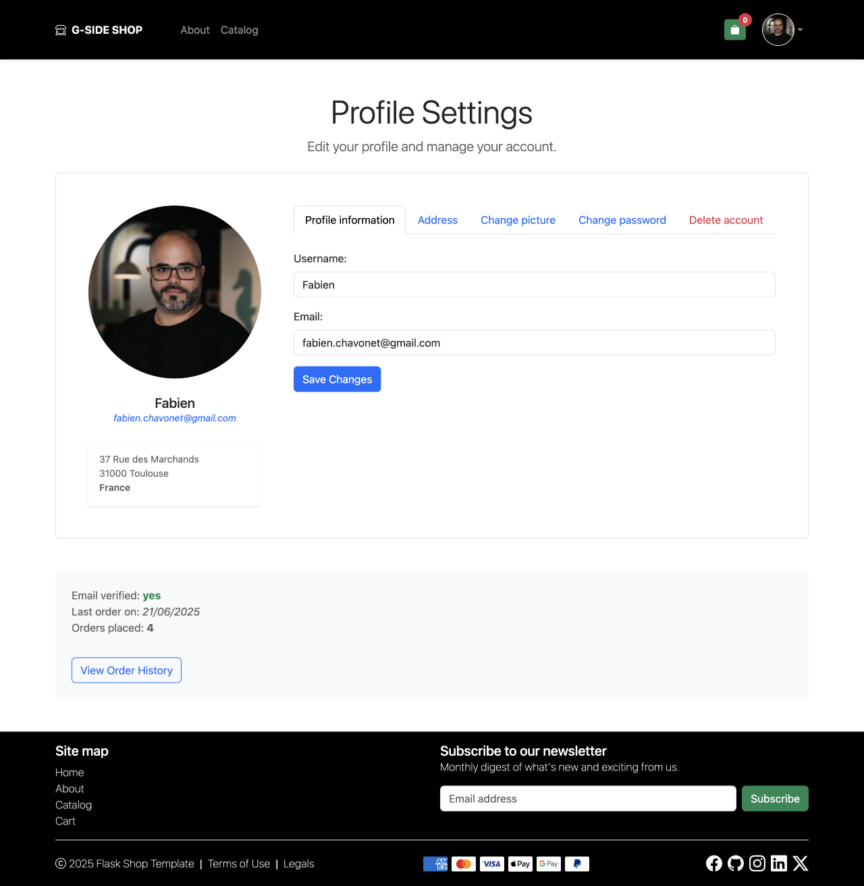

# Flask Shop Template

## Description

Flask Shop Template is a fully custom e-commerce website built from scratch using Flask, HTML, CSS, and JavaScript, with Bootstrap for layout and styling support.

I designed and developed both the backend and the frontend entirely by myself, without using any pre-existing templates.

The purpose of this project is to serve as a personal template for future e-commerce applications and as a practical exercise to:

- Improve my skills in building RESTful APIs and backend logic with Flask.
- Apply best practices in structuring and developing a standard e-commerce platform.
- Experiment with common backend logic such as user management, product catalog, shopping cart, and order processing.

This is my first fully coded e-commerce project. While it is not production-ready and may contain security vulnerabilities, it is a work in progress and will continue to evolve as I learn and improve.

## Objectives

- Create a simple, functional e-commerce template using Flask.
- Implement routing, Jinja templates, and HTML forms.
- Dynamically manage user sessions, products and cart logic.
- Use Bootstrap to create a clean, responsive, and mobile-friendly layout.
- Structure the project clearly and modularly.

## Tech Stack


## File Description

| **FILE**           | **DESCRIPTION**                                     |
| :----------------: | --------------------------------------------------- |
| `assets`           | Contains the resources required for the repository. |
| `app`              | Main application package.                           |
| `static`           | Static files (CSS, JS, images…).                    |
| `templates`        | Jinja2 HTML templates rendered by Flask.            |
| `config.py`        | Configuration file for environment settings.        |
| `run.py`           | Entry point to start the Flask development server.  |
| `requirements.txt` | List of dependencies required for the script.       |
| `.gitignore`       | Specifies files and folders to be ignored by Git.   |
| `README.md`        | The README file you are currently reading 😉.       |

## Installation & Usage

### Installation

1. Clone this repository:
    - Open your preferred Terminal.
    - Navigate to the directory where you want to clone the repository.
    - Run the following command:

```
git clone https://github.com/fchavonet/web-flask_shop_template.git
```

2. Open the cloned repository.

3. Create a virtual environment:

```
python3 -m venv venv
```

4. Activate the virtual environment:

```
source venv/bin/activate
```

> On Windows: `venv\Scripts\activate`.

5. Install dependencies:

```
pip install -r requirements.txt
```

6. Initialize the database:

```
flask --app app init-database
```

7. Open a Flask shell:

```
flask --app app shell
```

8. Then create an admin user manually for testing purposes:

```
admin = User(username="admin", email="admin@example.com", is_admin=True)
admin.set_password("demo")
db.session.add(admin)
db.session.commit()
exit()
```

### Usage

1. Start the development server:

```
python run.py
```

2. Open your browser and go to [http://127.0.0.1:5000](http://127.0.0.1:5000).

3. Sign in as admin:

- Use the credentials you created (admin / demo) to log in.
- Access the admin dashboard to manage products.

4. Test the customer experience:

- Register a new user via the signup form.
- Log in and browse products.
- Add items to the cart.
- Simulate checkout (no payment integration yet).

5. You can also download and run the included demo (G-Side Shop):

- Download the ready-to-use archive: [demo-gside.zip](https://github.com/fchavonet/web-flask_shop_template/raw/main/assets/files/demo-gside.zip).
- Extract it where you want to test the project.
- Start the server as usual to explore the sample store, G-Side Shop, a fictional G-Shock® boutique.

- Demo credentials:
  - Admin: `admin / demo`
  - Customer: `Fabien / Démo2025`

This demo allows you to test a pre-configured environment and should give a result similar to the screenshots below.







## What's Next?

- Add user management features to the admin dashboard.
- Enhance the user profile section.
- Refactor the codebase to include a fully documented RESTful API (likely with Flask-RESTx).
- Integrate a real database backend.
- Strengthen overall security (forms, routes, data handling, etc...).
- Add Stripe for secure payment processing.
- Improve responsiveness and accessibility across devices.
- Add animations and micro-interactions to enhance user experience.

## Thanks

- A big thank you to my friends Pierre and Yoann, always available to test and provide feedback on my projects.

## Author(s)

**Fabien CHAVONET**
- GitHub: [@fchavonet](https://github.com/fchavonet)

