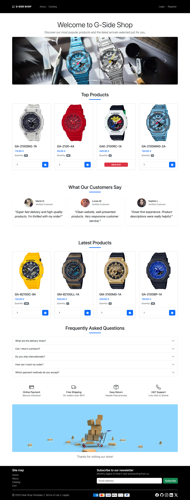
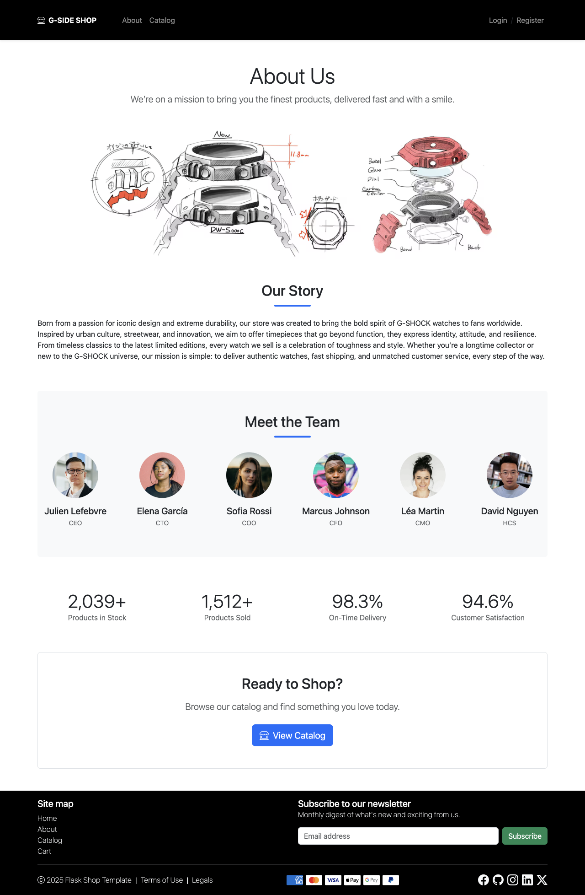
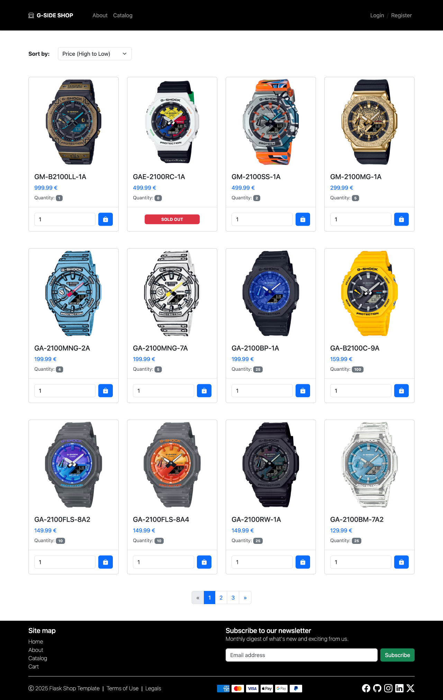
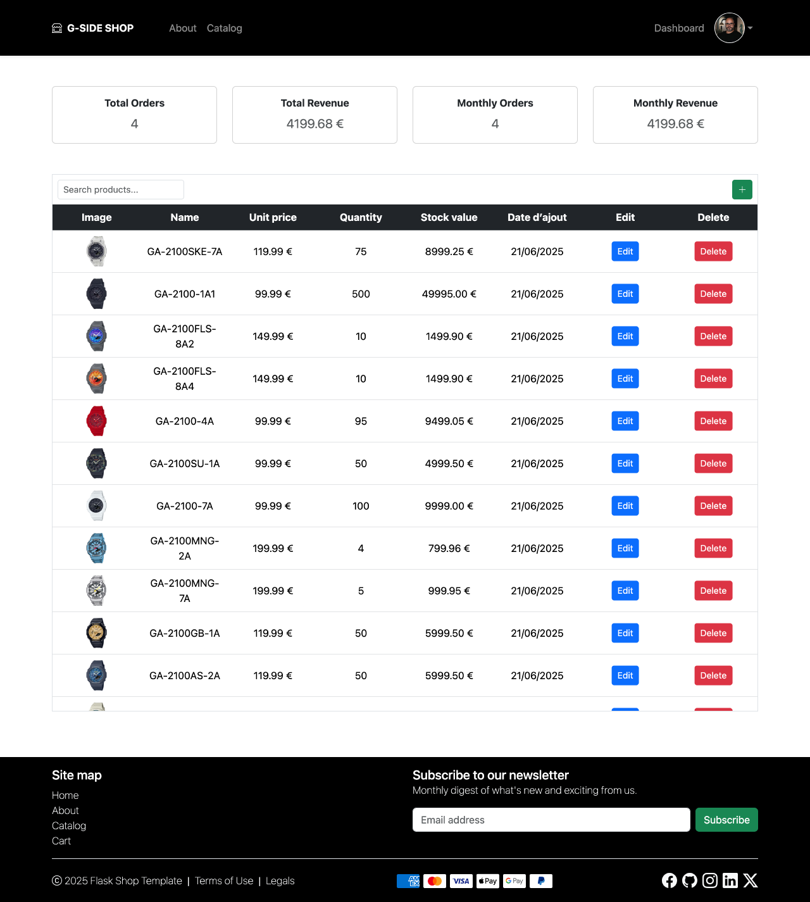
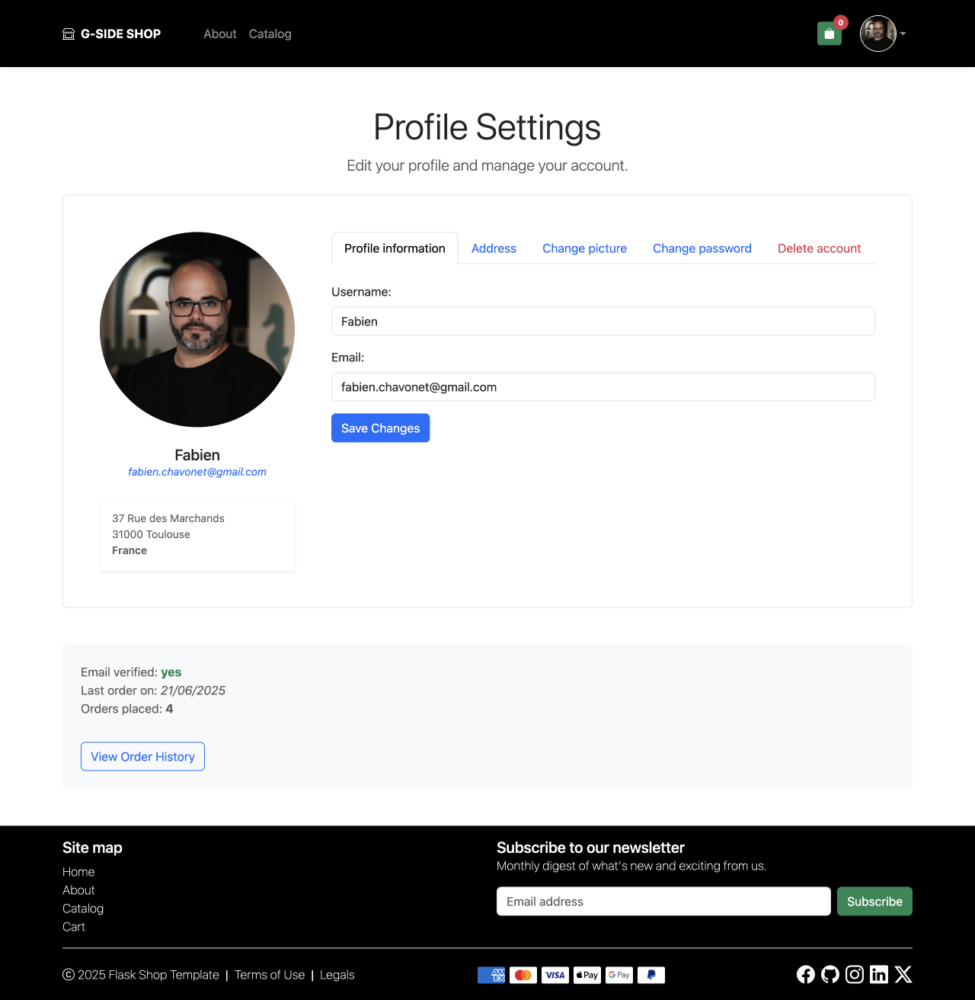

# Flask Shop Template

## 🔖 Table of contents

<details>
    <summary>
        CLICK TO ENLARGE 😇
    </summary>
    📄 <a href="#description">Description</a>
    <br>
    🎓 <a href="#objectives">Objectives</a>
    <br>
    🔨 <a href="#tech-stack">Tech stack</a>
    <br>
    📂 <a href="#files-description">Files description</a>
    <br>
    💻 <a href="#installation_and_how_to_use">Installation and how to use</a>
    <br>
    🔧 <a href="#whats-next">What's next?</a>
    <br>
    ♥️ <a href="#thanks">Thanks</a>
    <br>
    👷 <a href="#authors">Authors</a>
</details>

## 📄 <span id="description">Description</span>

Flask Shop Template is a fully custom e-commerce website built from scratch using Flask, HTML, CSS, and JavaScript (with the help of Bootstrap).
<br>
I designed and developed both the backend and the frontend entirely by myself, without using any pre-existing templates.
<br>
The purpose of this project is to serve as a personal template for future e-commerce applications and as a practical exercise to:

- Improve my skills in building RESTful APIs with Flask.
- Apply best practices in structuring and developing a standard e-commerce platform.
- Experiment with common backend logic such as user management, product catalog, shopping cart, and order processing.

This is my first fully coded e-commerce project. While it is not production-ready and may contain security vulnerabilities, it is a work in progress and will continue to evolve as I learn and improve.

## 🎓 <span id="objectives">Objectives</span>

- Create a simple, functional e-commerce template using Flask.
- Implement routing, Jinja templates, and HTML forms.
- Dynamically manage user sessions, products and cart logic.
- Use Bootstrap to build a responsive and clean layout.
- Structure the project clearly and modularly.

## 🔨 <span id="tech-stack">Tech stack</span>

<p align="left">
    
    
    
    
    
    
    
    
    
    
</p>

## 📂 <span id="files-description">File description</span>

| **FILE**           | **DESCRIPTION**                                     |
| :----------------: | --------------------------------------------------- |
| `assets`           | Contains the resources required for the repository. |
| `app`              | Main application package                            |
| `static`           | Static files (CSS, JS, images…).                    |
| `templates`        | Jinja2 HTML templates rendered by Flask.            |
| `config.py`        | Configuration file for environment settings.        |
| `run.py`           | Entry point to start the Flask development server.  |
| `requirements.txt` | List of dependencies required for the script.       |
| `.gitignore`       | Specifies files and folders to be ignored by Git.   |
| `README.md`        | The README file you are currently reading 😉.       |

## 💻 <span id="installation_and_how_to_use">Installation and how to use</span>

**Installation:**

1. Clone this repository:
    - Open your preferred Terminal.
    - Navigate to the directory where you want to clone the repository.
    - Run the following command:

```bash
git clone https://github.com/fchavonet/web-flask_shop_template.git
```

2. Open the repository you've just cloned.

3. Create a virtual environment:

```bash
python3 -m venv venv
```

4. Activate the virtual environment:

```bash
source venv/bin/activate
```

5. Install dependencies:

```bash
pip install -r requirements.txt
```

6. Initialize database:

```bash
flask --app app init-database
```

7. Open a Flask shell:

```bash
flask --app app shell
```

8. Then create an admin (for testing) user manually:

```bash
admin = User(username="admin", email="admin@example.com", is_admin=True)
admin.set_password("demo")
db.session.add(admin)
db.session.commit()
exit()
```

**How to use:**

1. Start the development server:

```
python run.py
```

2. Open your browser and go to [http://127.0.0.1:5000](http://127.0.0.1:5000).

3. Sign in as admin:

- Use the credentials you created (admin / demo) to log in.
- Access the admin dashboard to manage products.

4. Test the customer experience:

- Register a new user via the signup form.
- Log in and browse products.
- Add items to the cart.
- Simulate checkout (no payment integration yet).

5. You can also download and run the included demo (G-Side Shop):

- Download the ready-to-use archive: <a href="https://github.com/fchavonet/web-flask_shop_template/raw/main/assets/files/demo-gside.zip" download>demo-gside.zip</a>.
- Extract it where you want to test the project.
- Start the server as usual to explore the sample store, G-Side Shop, a fictional G-Shock® boutique.

- Demo credentials:
  - Admin: `admin / demo`
  - Customer: `Fabien / Démo2025`

This demo allows you to test a pre-configured environment and should give a result similar to the screenshots below.

<table>
    <tr>
        <th align="center" style="text-align: center;">G-SIDE SHOP</th>
    </tr>
    <tr valign="top">
        <td align="center">
            
        </td>
    </tr>
    <tr valign="top">
        <td align="center">
            
        </td>
    </tr>
    <tr valign="top">
        <td align="center">
            
        </td>
    </tr>
    <tr valign="top">
        <td align="center">
            
        </td>
    </tr>
    <tr valign="top">
        <td align="center">
            
        </td>
    </tr>
</table>

## 🔧 <span id="whats-next">What's next?</span>

- Add user management features in the admin dashboard.
- Enhance the user profile section.
- Refactor the codebase to implement a fully documented RESTful API (likely with Flask-RESTx).
- Integrate a real database system.
- Ensure overall site security (forms, routes, data handling...).
- Add Stripe for secure payment processing.
- Improve responsive layout and accessibility across all devices.
- Add animations and micro-interactions throughout the site to improve user experience.

## ♥️ <span id="thanks">Thanks</span>

- A big thank you to my friends Pierre and Yoann, always available to test and provide feedback on my projects.

## 👷 <span id="authors">Authors</span>

**Fabien CHAVONET**
- GitHub: [@fchavonet](https://github.com/fchavonet)
